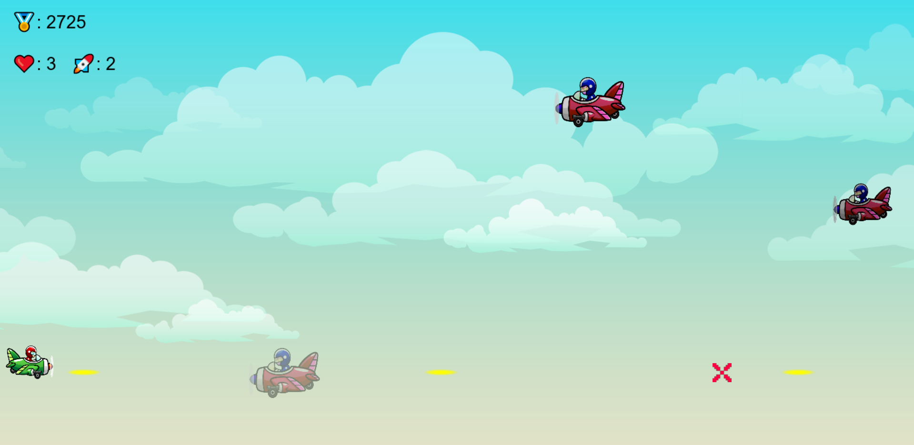
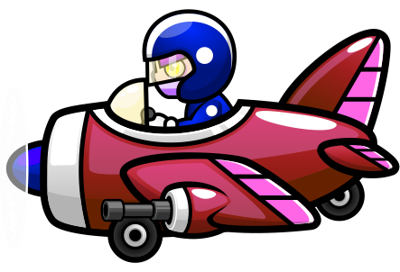
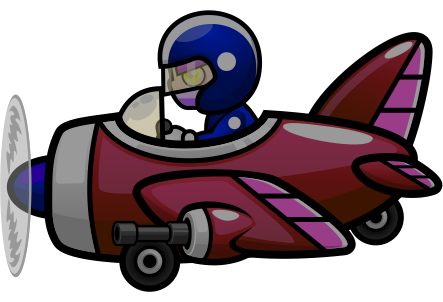
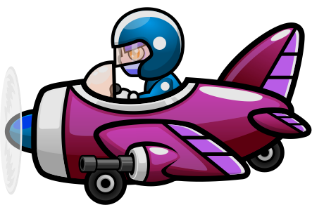

# Arcade-mini-game
Arcade mini-game on Javascript and HTML Canvas, University Web task

## Rules
- **Kill** enemies to increase your _**total score**_
- **Collect** 1000 points to start the _**Boss stage**_
- **Defeat** the _**Boss**_ to increase game level

## Controls
- **Raise** and **Lower** mouse cursor to control the character
- **Left click** to shoot with _**Gun**_ - light and fast projectile
- **Right click** to shoot with _**Rockets**_ - heavy and slow projectile
- **Hold** left mouse button to shoot in _**Machine gun mode**_ 
- **Press** space key to _**Pause**_ the game
- **Take** damage to cause the _**Shield**_ mechanics

## Types of enemies
### Default flying dude

- **Medium** speed
- **Low** hp
- **50** score value

### Heavy flying dude

- **Low** speed
- **High** hp
- **75** score value

### Elite flying dude

- **High** speed
- **Medium** hp
- **100** score value

### Boss dude

- **Medium** speed
- **Very high** hp
- **300** score value
- _**Lethal** damage!_
